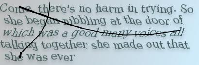
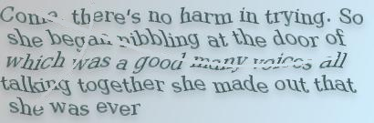
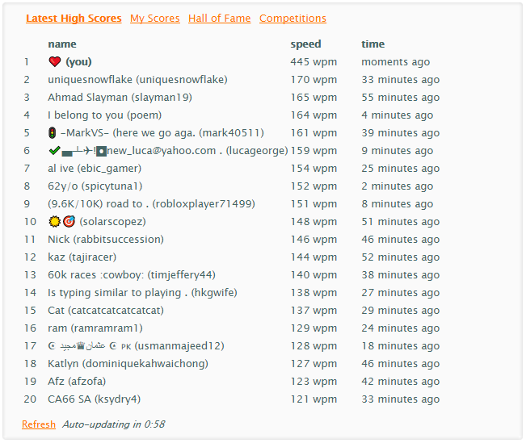
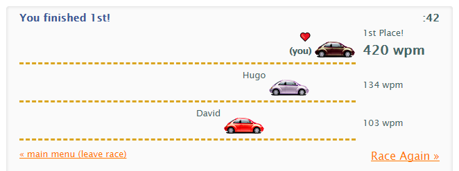

# typeracer-cheat

This repo contains the script I used to beat the online typing game [typeracer](https://play.typeracer.com/), topping the leaderboard with an inhuman WPM of almost 450.  
I do not recommend actually using this script on typeracer, it is against the TOS (your account will be banned, as was mine) and pollutes the leaderboard for other, real players. 
Instead, I find this project as just an interesting experiment and learning experience.

For anyone curious, I have outlined below each step of the process. Note that this particular method may no longer work in the future as typeracer may (and should) change the user validation procedure. I can confirm this script to be working as of 2020-02-16.

## Completing the race
Actually typing the race automatically is as simple as extracting the text from the DOM and sending the right set of JavaScript key events.  
While the speed of your race is determined by the time interval between the fake key presses (which can be arbitrarily low), it seems that if at any point your WPM surpasses 450, you are kicked from the game. Thus there is an upper limit on the WPM the script can obtain. To achieve 445 WPM (the highest I was able to get), keypresses were seperated by random time intervals between 22.5ms and 26.5ms.

After a high enough WPM (>100) you are presented with an image captcha which does not have a purely textual form anywhere on the client side - this is the real challenge.

## Completing the captcha
To validate your score you must be able to complete the captcha within a given time and with a high enough accuracy (~95% or greater). The captchas always contain 5 lines of warped (italicised and sinusoidal) text, with black markings covering the image.  

  
*A typical captcha*

Completing the captcha is a relatively long, messy, probabilistic, speculative, and manual process, however it only needs to be completed once, thus I have no intentions of streamlining the process.

### 1. Image pre-processing

Before reading the image, the script performs some pre-processing of the image using a temporary HTML canvas to make recognising the text easier. In particular, the image is scanned for any pixels which are dark enough to potentially be part of the black markings. When a pixel is found, the pixel is changed to represent the same colour as the background at that point in the image. 

  
*The same captcha image after pre-processing*

After this procedure was applied, I also attempted to reverse the sinisoidal warping effect. This was quite effective in improving the readability of a given image, however the actual period of the warping effect varies between images by a few pixels. Even applying the effect a couple pixels offset significantly reduces readability by the end of the image as the wave becomes out of phase. Thus, I decided to remove this section of pre-processing.

### 2. OCR

The next step is sending the pre-processed image we have created to an OCR (Optical Character Recognition) library called Tesseract. To allow the entire script to run within the browser, the script uses a JS port of the library avaliable [here](https://github.com/naptha/tesseract.js).

After a few seconds, Tesseract will return a chunk of text with an accuracy typically between 65% and 85%.

### 3. Text post-processing

Analysis of the text returned by Tesseract revealed some common mistakes which I could manually reverse with some string manipulation.

This consisted of various character substitutions such as
 - Replacing commonly misread characters with more likely alternatives  
 e.g replacing "|" (pipe) with "I" (captital i)
 - Ensuring there exists spaces after each comma and full stop.
 - Removing newlines (as typeracer does not track them)

### 4. Manual text modifications

Once the previous step is complete, the text is injected into the text box used to complete the captcha. At this point, the text is still not a high enough accuracy to pass the captcha, however there is time for manual edits to be made with about 3-5 seconds to spare.

To assist in this process, simple spelling errors can be easily fixed using the browsers built in spell check (right click, select recommended words from a list).

With all of these steps applied, it only took me around half a dozen tries to get an accuracy which satisifed the captcha.

## Results

### A **High** Score
  

### A *Nice* Score

